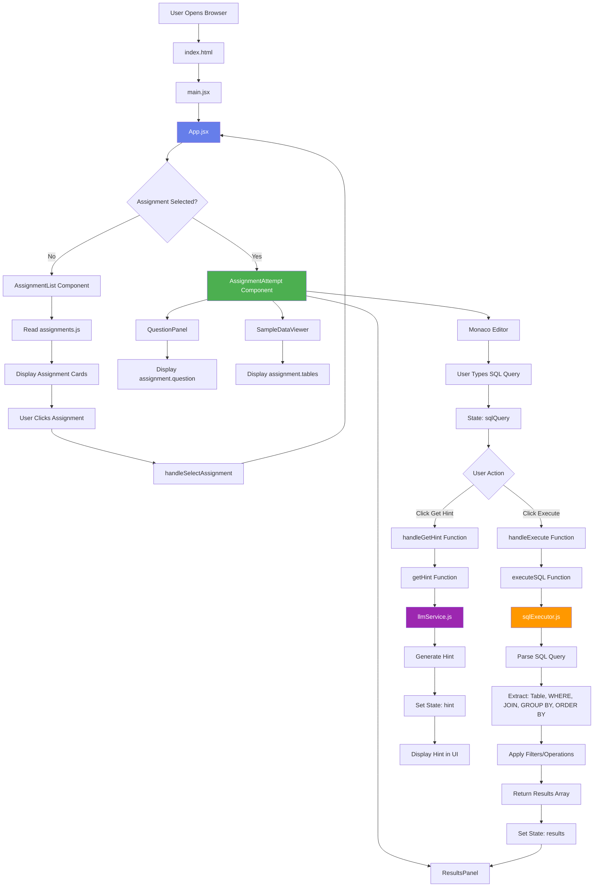

# CipherSQLStudio - Data Flow Diagram

## 🔄 Complete Data Flow Visualization

### Visual Diagram (Mermaid)



---

## 📊 Detailed Component Data Flow

### 1. Initial Load Flow

```
Browser
  │
  ├─→ index.html (loads)
  │   └─→ <div id="root"> (empty container)
  │
  ├─→ main.jsx (executes)
  │   └─→ ReactDOM.createRoot()
  │       └─→ Renders <App />
  │
  └─→ App.jsx (renders)
      ├─→ State: selectedAssignment = null
      └─→ Renders <AssignmentList />
          └─→ Reads assignments.js
              └─→ Maps through assignments array
                  └─→ Creates assignment cards
```

---

### 2. Assignment Selection Flow

```
User Clicks Assignment Card
  │
  ├─→ AssignmentList.onClick
  │   └─→ Calls onSelectAssignment(assignment)
  │       │
  │       └─→ App.jsx.handleSelectAssignment()
  │           └─→ setSelectedAssignment(assignment)
  │               │
  │               └─→ React Re-renders App.jsx
  │                   └─→ Condition: selectedAssignment ? true
  │                       └─→ Renders <AssignmentAttempt />
                          │   └─→ Receives assignment prop
                          │       │
                          │       ├─→ QuestionPanel
                          │       │   └─→ assignment.question
                          │       │
                          │       ├─→ SampleDataViewer
                          │       │   └─→ assignment.tables
                          │       │
                          │       ├─→ Monaco Editor
                          │       │   └─→ State: sqlQuery = ''
                          │       │
                          │       └─→ ResultsPanel
                          │           └─→ State: results = null
```

---

### 3. SQL Query Execution Flow

```
User Types SQL in Monaco Editor
  │
  ├─→ Editor onChange event
  │   └─→ setSqlQuery(value)
  │       └─→ State updated: sqlQuery = "SELECT * FROM employees WHERE salary > 50000"
  │
  ├─→ User Clicks "Execute Query" Button
  │   └─→ handleExecute() function
  │       │
  │       ├─→ Validation: Check if sqlQuery is not empty
  │       │
  │       ├─→ setLoading(true)
  │       ├─→ setError(null)
  │       ├─→ setResults(null)
  │       │
  │       └─→ Call executeSQL(sqlQuery, assignment.tables)
  │           │
  │           └─→ sqlExecutor.js
  │               │
  │               ├─→ executeSQL()
  │               │   └─→ Check query type (SELECT)
  │               │       └─→ Call executeSelect()
  │               │
  │               ├─→ executeSelect()
  │               │   ├─→ Extract table name: "employees"
  │               │   ├─→ Get data: assignment.tables.employees.sampleData
  │               │   │   └─→ [
  │               │   │       {id: 1, name: "John", salary: 75000},
  │               │   │       {id: 2, name: "Jane", salary: 60000},
  │               │   │       ...
  │               │   │   ]
  │               │   │
  │               │   ├─→ Check for JOIN → applyJoin() (if needed)
  │               │   │
  │               │   ├─→ Extract WHERE clause: "salary > 50000"
  │               │   │   └─→ applyWhereClause()
  │               │   │       ├─→ Parse operator: ">"
  │               │   │       ├─→ Parse column: "salary"
  │               │   │       ├─→ Parse value: 50000
  │               │   │       └─→ Filter data:
  │               │   │           └─→ Keep rows where salary > 50000
  │               │   │               └─→ [
  │               │   │                   {id: 1, name: "John", salary: 75000},
  │               │   │                   {id: 2, name: "Jane", salary: 60000},
  │               │   │                   {id: 4, name: "Alice", salary: 55000}
  │               │   │               ]
  │               │   │
  │               │   ├─→ Check for GROUP BY → applyGroupBy() (if needed)
  │               │   │
  │               │   ├─→ Check for ORDER BY → applyOrderBy() (if needed)
  │               │   │
  │               │   └─→ Select columns → selectColumns() (if not SELECT *)
  │               │
  │               └─→ Return filtered results array
  │                   │
  │                   └─→ Back to handleExecute()
  │                       ├─→ setResults(queryResults)
  │                       ├─→ setLoading(false)
  │                       │
  │                       └─→ React Re-renders ResultsPanel
  │                           └─→ Displays results in table format
```

---

### 4. Hint Request Flow

```
User Clicks "Get Hint" Button
  │
  ├─→ handleGetHint() function
  │   │
  │   ├─→ setHintLoading(true)
  │   ├─→ setHint(null)
  │   │
  │   └─→ Call getHint(assignment.question, sqlQuery)
  │       │
  │       └─→ llmService.js
  │           │
  │           ├─→ getHint()
  │           │   ├─→ Input: question = "Write a SQL query to..."
  │           │   ├─→ Input: currentQuery = "SELECT * FROM..."
  │           │   │
  │           │   └─→ generateContextualHints()
  │           │       ├─→ Analyze question and current query
  │           │       ├─→ Check if query has WHERE, JOIN, etc.
  │           │       └─→ Return contextual hint:
  │           │           "You need to filter the results. 
  │           │            Consider using a WHERE clause..."
  │           │
  │           └─→ Return hint text
  │               │
  │               └─→ Back to handleGetHint()
  │                   ├─→ setHint(hintText)
  │                   ├─→ setHintLoading(false)
  │                   │
  │                   └─→ React Re-renders UI
  │                       └─→ Hint panel displays below editor
```

---

## 🔄 State Flow Diagram

```
┌─────────────────────────────────────────────────────────┐
│                    App.jsx State                         │
│  selectedAssignment: null | Assignment Object           │
└─────────────────────────────────────────────────────────┘
                    │
        ┌───────────┴───────────┐
        │                       │
        ▼                       ▼
┌──────────────┐      ┌──────────────────────┐
│ Assignment   │      │ AssignmentAttempt    │
│ List         │      │ State:               │
│              │      │ - sqlQuery: string   │
│ (No State)   │      │ - results: array     │
│              │      │ - error: string      │
│              │      │ - loading: boolean   │
│              │      │ - hint: string       │
└──────────────┘      └──────────────────────┘
                              │
                    ┌─────────┼─────────┐
                    │         │         │
                    ▼         ▼         ▼
            ┌──────────┐ ┌─────────┐ ┌──────────┐
            │ Question │ │ Sample  │ │ Results  │
            │ Panel    │ │ Data    │ │ Panel    │
            │          │ │ Viewer  │ │          │
            │ (Props)  │ │ (Props) │ │ (State)  │
            └──────────┘ └─────────┘ └──────────┘
```

---

## 📥 Input → Output Flow

### Assignment List Screen

```
Input:  User clicks assignment card
  │
  └─→ Output: Assignment object passed to App.jsx
            │
            └─→ State updated in App.jsx
                │
                └─→ Output: AssignmentAttempt component rendered
                          │
                          └─→ Assignment data flows down as props
```

### Query Execution

```
Input:  SQL Query String
  │     "SELECT * FROM employees WHERE salary > 50000"
  │
  ├─→ sqlExecutor.js
  │   │
  │   ├─→ Input: assignment.tables (sample data)
  │   │
  │   └─→ Process: Parse → Filter → Transform
  │       │
  │       └─→ Output: Filtered results array
  │           [
  │             {id: 1, name: "John", salary: 75000},
  │             {id: 2, name: "Jane", salary: 60000},
  │             ...
  │           ]
  │
  └─→ ResultsPanel
      │
      └─→ Output: Formatted HTML table displayed
```

### Hint Request

```
Input:  assignment.question (string)
Input:  sqlQuery (string)
  │
  └─→ llmService.js
      │
      └─→ Process: Analyze → Generate hint
          │
          └─→ Output: Hint text (string)
              "You need to filter the results. 
               Consider using a WHERE clause..."
              │
              └─→ Displayed in hint panel
```

---

## 🔗 Component Communication Flow

```
┌─────────────┐
│   App.jsx   │ (Parent - State Manager)
└──────┬──────┘
       │
       ├─────────────────┐
       │                 │
       ▼                 ▼
┌──────────────┐  ┌──────────────────┐
│ Assignment   │  │ Assignment       │
│ List         │  │ Attempt          │
│              │  │                  │
│ Props:       │  │ Props:           │
│ - onSelect   │  │ - assignment     │
│   Assignment │  │ - onBack         │
│   (function) │  │                  │
│              │  │                  │
│ Calls:       │  │ Calls:           │
│ onSelect(    │  │ - executeSQL()   │
│   assignment │  │ - getHint()      │
│ )            │  │                  │
└──────────────┘  └────────┬─────────┘
                           │
              ┌────────────┼────────────┐
              │            │            │
              ▼            ▼            ▼
      ┌───────────┐ ┌───────────┐ ┌──────────┐
      │ Question  │ │ Sample    │ │ Results  │
      │ Panel     │ │ Data      │ │ Panel    │
      │           │ │ Viewer    │ │          │
      │ Props:    │ │ Props:    │ │ Props:   │
      │ - question│ │ - tables  │ │ - results│
      └───────────┘ └───────────┘ └──────────┘
```

---

## 🎯 Key Data Transformations

### 1. Assignment Data Transformation

```
assignments.js (Source)
  │
  └─→ Array of assignment objects
      │
      ├─→ AssignmentList maps through array
      │   └─→ Transforms to JSX cards
      │
      └─→ Selected assignment passed as prop
          │
          └─→ AssignmentAttempt receives it
              │
              ├─→ Extracts question → QuestionPanel
              ├─→ Extracts tables → SampleDataViewer
              └─→ Used for SQL execution
```

### 2. SQL Query Transformation

```
User Input (String)
  "SELECT * FROM employees WHERE salary > 50000"
    │
    ├─→ Parsed by sqlExecutor.js
    │   │
    │   ├─→ Table: "employees"
    │   ├─→ Columns: "*" (all)
    │   ├─→ WHERE: "salary > 50000"
    │   │   ├─→ Column: "salary"
    │   │   ├─→ Operator: ">"
    │   │   └─→ Value: 50000
    │   │
    │   └─→ Applied to data array
    │       │
    │       └─→ Filtered array returned
    │
    └─→ Displayed as table in ResultsPanel
```

### 3. Sample Data Structure

```
assignment.tables (Source)
  │
  └─→ {
      employees: {
        schema: "id (INT), name (VARCHAR), salary (INT)",
        sampleData: [
          {id: 1, name: "John", salary: 75000},
          {id: 2, name: "Jane", salary: 60000},
          ...
        ]
      }
    }
    │
    ├─→ Displayed in SampleDataViewer (formatted table)
    └─→ Used by sqlExecutor (for query execution)
```

---

## 🔄 Complete User Journey Data Flow

```
1. INITIALIZATION
   Browser → index.html → main.jsx → App.jsx → AssignmentList
   Data: assignments.js loaded

2. ASSIGNMENT SELECTION
   User Click → AssignmentList → App.jsx (state update)
   Data: assignment object stored in state

3. ASSIGNMENT VIEW
   App.jsx → AssignmentAttempt (receives assignment prop)
   Data: assignment.question, assignment.tables

4. QUERY WRITING
   User Types → Monaco Editor → State update (sqlQuery)

5. QUERY EXECUTION
   Button Click → handleExecute → executeSQL
   Input: sqlQuery string + assignment.tables
   Process: Parse, filter, transform
   Output: results array → State update → ResultsPanel

6. HINT REQUEST
   Button Click → handleGetHint → getHint
   Input: question + sqlQuery
   Output: hint text → State update → Hint Panel

7. BACK TO LIST
   Back Button → onBack → App.jsx (state reset)
   Data: selectedAssignment = null
```

---

## 📝 Summary

**Main Data Flows:**

1. **Assignment Data**: `assignments.js` → `AssignmentList` → `App.jsx` → `AssignmentAttempt` → Child components
2. **SQL Query**: User Input → `sqlQuery` state → `sqlExecutor.js` → Results array → `ResultsPanel`
3. **Hints**: Question + Query → `llmService.js` → Hint text → Hint Panel
4. **State Management**: `App.jsx` manages which screen to show; `AssignmentAttempt` manages query, results, errors, hints

**Key Points:**
- Data flows DOWN via props (parent to child)
- Events flow UP via callbacks (child to parent)
- State changes trigger re-renders
- Components are reusable and independent

